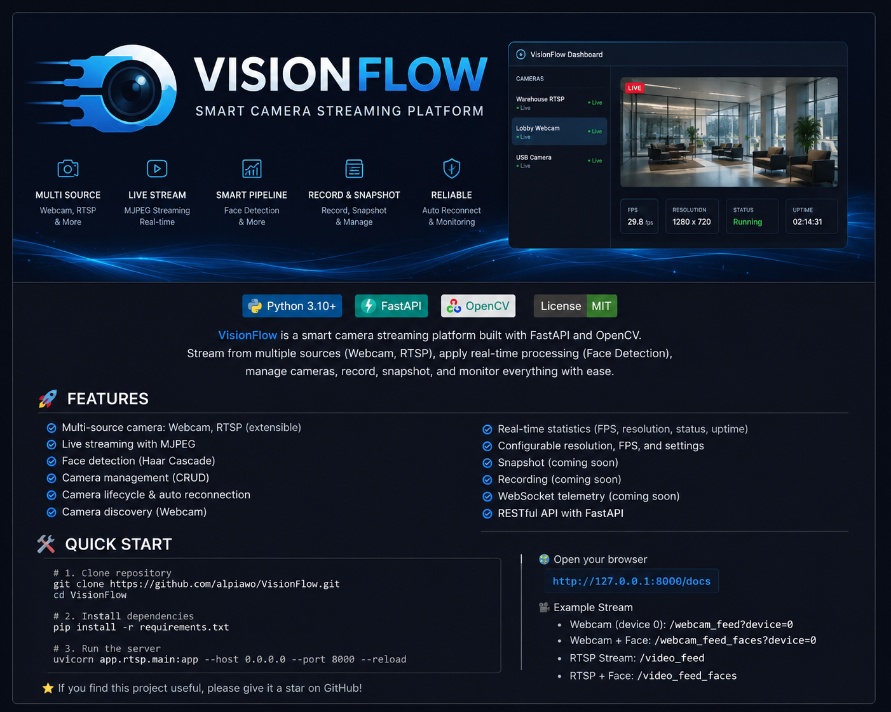

<p align="center">
  
</p>

<p align="center">
  <strong>Smart camera streaming platform built with FastAPI and OpenCV.</strong>
</p>

<p align="center">
  Multi-source camera input · Camera lifecycle management · Real-time processing · MJPEG streaming
</p>

## Overview

VisionFlow is a FastAPI + OpenCV camera streaming service designed around multiple camera sources, lifecycle management, live MJPEG streaming, and optional real-time processing.

The project currently supports local laptop webcams, external USB webcams, and RTSP cameras while keeping camera management separate from the HTTP streaming layer.

## Features

- Laptop webcam streaming
- External USB webcam streaming
- RTSP camera streaming
- Webcam discovery
- Camera source management through REST API
- Start and stop camera sessions
- Automatic camera reconnect
- Camera status and FPS statistics
- Configurable resolution, FPS, and reconnect delay
- Optional real-time face detection
- Browser-compatible MJPEG output
- Legacy streaming endpoints preserved for compatibility

## Project Structure

```text
project-root/
├── app/
│   ├── camera/
│   │   ├── __init__.py
│   │   └── manager.py
│   ├── rtsp/
│   │   ├── camera_rtsp.py
│   │   ├── face_detector.py
│   │   └── main.py
│   └── webcam/
│       ├── __init__.py
│       └── camera.py
├── assets/
│   └── vision-flow.png
├── models/
├── requirements.txt
└── README.md
```

## Requirements

- Python 3.9+
- OpenCV 4.x
- FastAPI
- Uvicorn
- A laptop webcam, USB webcam, or RTSP camera

VisionFlow currently uses a Caffe-based face detection model. OpenCV 5 removed the Caffe and Darknet DNN loaders, so the project intentionally pins `opencv-python` to version 4.x until the face detection model is migrated to ONNX. citehttps://github.com/opencv/opencv/wiki/OpenCV-4-to-5-migration

Create a virtual environment and install dependencies:

```bash
python -m venv venv
```

Windows:

```bash
venv\Scripts\activate
```

Linux/macOS:

```bash
source venv/bin/activate
```

```bash
pip install -r requirements.txt
```

If you already created the virtual environment before the OpenCV version constraint was added, reinstall OpenCV inside the active virtual environment:

```bash
python -m pip uninstall -y opencv-python opencv-contrib-python
python -m pip install "opencv-python>=4.10,<5"
```

Verify the installed version:

```bash
python -c "import cv2; print(cv2.__version__)"
```

The version should start with `4.`.

## Run

```bash
uvicorn app.rtsp.main:app --host 0.0.0.0 --port 8000
```

Open the API documentation at `/docs` to manage cameras and test endpoints.

## Camera Management API

List configured cameras:

```text
GET /api/cameras
```

Discover available local webcams:

```text
GET /api/cameras/discover
```

Create a webcam:

```json
{
  "name": "Laptop Webcam",
  "type": "webcam",
  "source": "0",
  "width": 1280,
  "height": 720,
  "fps": 30,
  "face_detection": false,
  "reconnect_delay": 2
}
```

Create an RTSP camera:

```json
{
  "name": "Warehouse Camera",
  "type": "rtsp",
  "source": "rtsp://192.168.1.20:8554/cam",
  "face_detection": false
}
```

The camera API provides:

- `POST /api/cameras` to register a camera
- `GET /api/cameras` to list cameras
- `GET /api/cameras/{id}` to inspect a camera
- `PATCH /api/cameras/{id}` to update configuration
- `DELETE /api/cameras/{id}` to remove a camera
- `POST /api/cameras/{id}/start` to start capture
- `POST /api/cameras/{id}/stop` to stop capture
- `GET /api/cameras/{id}/stream` to open the MJPEG stream

## Legacy Streaming Endpoints

The original stream URLs remain available:

- Laptop/default webcam: `http://127.0.0.1:8000/webcam_feed?device=0`
- External webcam: `http://127.0.0.1:8000/webcam_feed?device=1`
- Webcam + face detection: `http://127.0.0.1:8000/webcam_feed_faces?device=0`
- RTSP stream: `http://127.0.0.1:8000/video_feed`
- RTSP + face detection: `http://127.0.0.1:8000/video_feed_faces`

## Camera Lifecycle

Each managed camera has an independent session with these states:

```text
stopped
   ↓
starting
   ↓
running
   ↓
reconnecting
   ↓
running
```

If the camera cannot be opened or a frame read fails, VisionFlow releases the capture, waits for the configured reconnect delay, and attempts to reconnect while the session remains active.

## Architecture

```text
Camera Source
     │
     ├── Webcam
     └── RTSP
     │
     ▼
CameraManager
     │
     ▼
CameraSession
     │
     ├── Capture lifecycle
     ├── Reconnect handling
     ├── FPS statistics
     └── Processing
            │
            └── Face Detection
     │
     ▼
JPEG Encoder
     │
     ▼
FastAPI MJPEG Stream
```

The camera manager is intentionally independent from the HTTP endpoint. This makes it possible to add recording, snapshots, WebSocket telemetry, additional processing pipelines, and a frontend without coupling those features directly to OpenCV capture code.

## Roadmap

- Snapshot and image capture
- Video recording
- WebSocket telemetry
- Additional processing pipelines
- Multi-camera dashboard
- Authentication and access control
- Migrate face detection from Caffe to ONNX

## License

This project is licensed under the MIT License.
